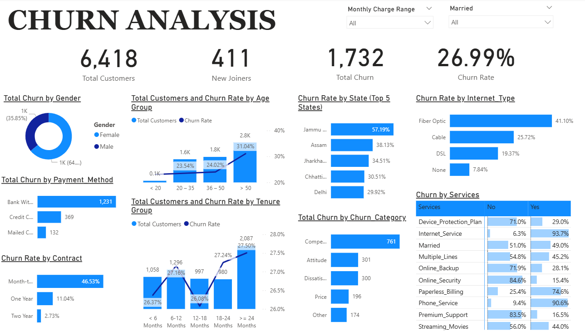

# 📊 Churn Analysis – End-to-End Data Pipeline & Predictive Modeling

  
*A Power BI dashboard for customer churn analysis & prediction*  

## Project Overview
This project demonstrates a **complete data pipeline** — from raw data ingestion to **interactive analytics** and **machine learning–based churn prediction**.  
It simulates a real-world business scenario where organizations need to monitor churn, identify high-risk segments, and take **data-driven retention actions**.

## Tech Stack
- **SQL Server Management Studio (SSMS)** → ETL pipeline, staging → production tables, views  
- **Python (pandas, scikit-learn, Jupyter)** → Data preprocessing, feature engineering, Random Forest model  
- **Power BI** → Interactive dashboard for stakeholder insights & churn profiling  

## Key Components

### 1️⃣ ETL Pipeline (SQL Server)
- Designed a full **Extract–Transform–Load (ETL)** workflow using SSMS.  
- Imported raw customer data into **staging tables**, applied cleaning (null handling, type fixes), and built **production-ready tables**.  
- Created SQL **views** for analytics and ML input (`vw_churn_data`, `vw_join_data`).  

### 2️⃣ Data Preprocessing (Python)
- Used **pandas** for cleaning & transformation.  
- Applied **feature encoding** (categorical → numerical), engineered variables (e.g., churn flag).  
- Balanced train-test split for robust evaluation.  

### 3️⃣ Machine Learning Model
- Trained a **Random Forest Classifier** to predict churn probability.  
- Achieved **84% accuracy** with strong precision/recall balance.  
- Exported predictions on active customers for targeted retention campaigns.  

### 4️⃣ Interactive Dashboard (Power BI)
- Created a professional dashboard highlighting churn patterns by:  
  - **Demographics** (age, gender, marital status)  
  - **Geographic distribution** (state-wise churn)  
  - **Account attributes** (tenure, contracts, payment methods)  
  - **Services usage** (internet, device protection, streaming, etc.)  
- Implemented **drill-throughs, slicers, and KPIs** (Total Customers, Churn Rate, New Joiners).
  
## Business Impact
- Enables **early identification** of high-risk customers.  
- Provides **actionable insights** for marketing & retention teams.  
